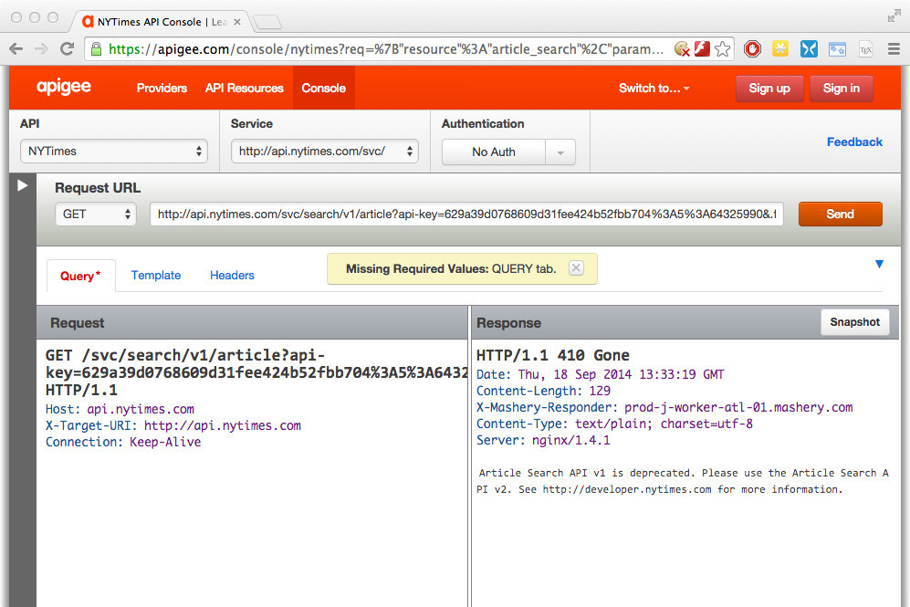
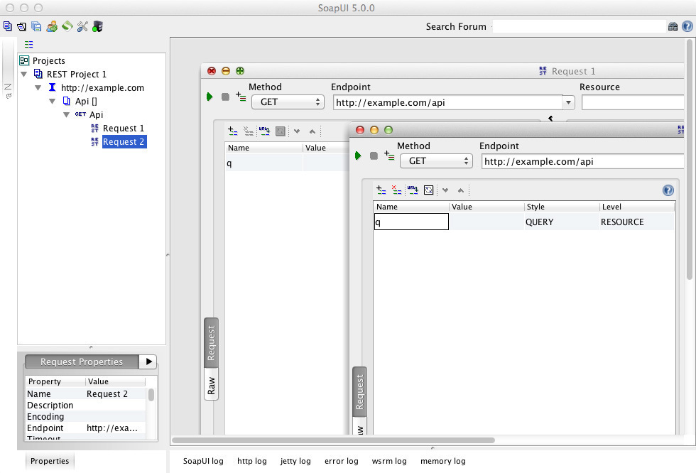
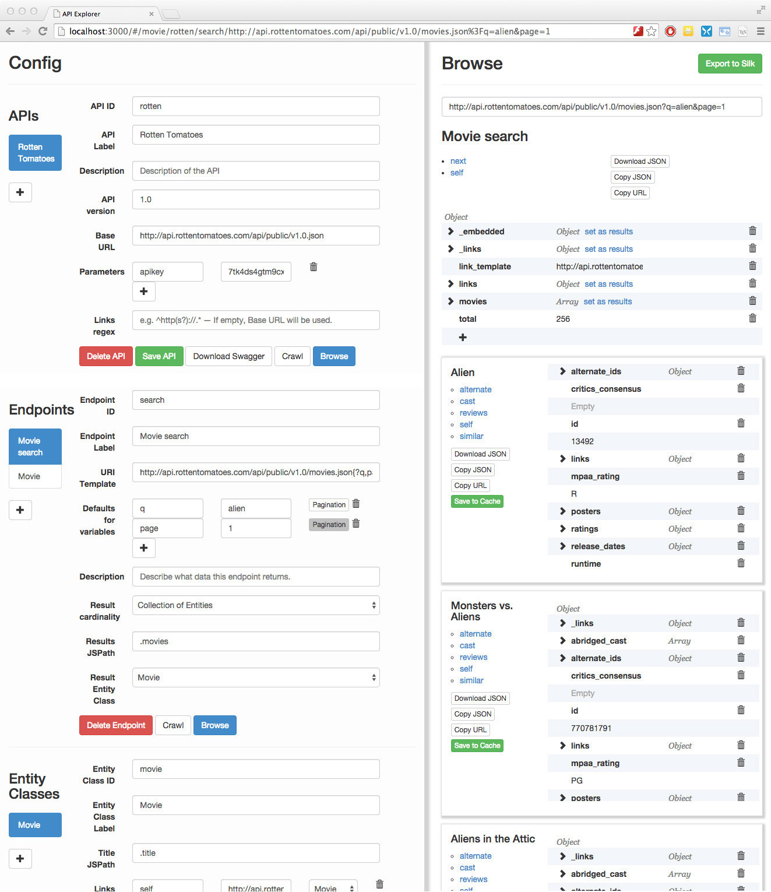

# Definitions and Abbreviations

IANA
:    The Internet Assigned Numbers Authority is a department of ICANN (Internet Corporation for Assigned Names and Numbers). ICANN is a nonprofit private American corporation.

IRI
:    Internationalized Resource Identifier as defined in [RFC 3987](https://tools.ietf.org/html/rfc3987). A IRI is basically a URI that is not limited to ASCII.

RDF
:    Resource Description Framework is “a framework for representing information in the Web” [@rdf]. It uses sets of subject-predicate-object triples to express the relationships between resources, in effect forming a graph.

RFC
:    A Request for Comments is a publication of the Internet Engineering Task Force (IETF). Some RFCs are later adopted as Internet Standards.

RPC
:    Remote Procedure Call is a way of invoking a service on another computer over a network that follows the style of a local function call very closely.

URI
:    Uniform Resource Identifier as defined in [RFC 3986](http://tools.ietf.org/html/rfc3986)

URL
:    Uniform Resource Locator as defined in [RFC 3986](http://tools.ietf.org/html/rfc3986). A URL is a URI that does not only uniquely identify a resource, but can also be used to locate it by dereferencing the URL.

Web API
:    In this thesis, the term “Web API” refers to an API that is exposed by a web server, usually via HTTP.

WSDL
:    Web Service Description Language is an XML-based interface description language that is used to describe the interface of a web service, usually used in conjunction with SOAP.

SOAP
:    Started in 1998, SOAP is an XML-based protocol specification for services and the messages they exchange. The model is conceptually very similar to the remote procedure call paradigm.

UDDI
:    Designed to integrate with SOAP, Universal Description Discovery and Integration is an XML-based mechanism to register and locate web services.
\newpage


# Introduction

We are interested in the problem of accessing and importing the information that is contained in the databases powering websites and public Web APIs.

The SOAP ecosystem was rich in native and machine-friendly methods to describe and discover Web services (e.g. [WSDL](http://en.wikipedia.org/wiki/Web_Services_Description_Language) and [UDDI](http://en.wikipedia.org/wiki/Universal_Description_Discovery_and_Integration) respectively). However, among public Web APIs, SOAP has been superseded by what many feel is a simpler and leaner style of Web services: REST. The term was coined in 2000 by Roy Fielding in his dissertation. Soon all major public Web services proclaimed to be RESTful.

For better or worse, the current de-facto standard of a public Web service is a REST API that talks JSON. The result is a dynamic and quickly changing bunch of Web APIs that are broadly speaking very similar (they all support JSON over HTTP), yet they vary widely in the crucial yet unstandardized details (e.g. how to find related resources, what part of the JSON is envelope and what the actual data, etc.). Furthermore, unlike SOAP services, they usually have no machine-readable documentation. This makes it very hard to write a generic tool to import data from a multitude of Web APIs into a user’s own database.

What is more, most public Web APIs do not follow Fielding’s criteria for a RESTful service very closely. For example, few follow the HATEOAS principle—i.e. do not contain links to further resources. Instead, the API client has to rely on human-readable (i.e. non-machine-readable) documentation to know what further resources are available under what URL. Thus this information has to be hard-coded when the client code is written, and updated when the server changes, introducing tight coupling between the server and the client. Nonetheless, these REST APIs expose an unprecedented wealth of information in an at least superficially machine-readable format. As such, Web APIs are our best (and besides web scraping often only) way to get our hands on the information contained in many websites.

The aim of this thesis is to build a tool with a web-based GUI to support a user to quickly import data from generic JSON REST APIs. The target user is possibly trained, but no computer scientist, so for example a data journalist. The first thing the user will have to do is to enter the URL of an API entry point into the tool. From thereon, he or she will be guided to navigate the API and construct a declarative representation of the API. Ultimately, the user can make use of this description by connecting to our tool’s HAL-compliant hypermedia wrapper Web API, thus accessing the mapped APIs through a uniform interface.
\newpage

# Background

## REST

### The REST Architectural Style

In his 2000 dissertation, Roy Thomas Fielding coined the term REST [@fielding2000, Abstract]. While often misunderstood [@fielding2008], his dissertation has nonetheless been very influential. As of today, there exist an abundance of Web APIs that claim to be RESTful, even though most of them don’t adhere to all the criteria listed by Fielding.

In his dissertation, Fielding analyzed the architecture of the World Wide Web and generalized it to an architectural style for network-based application software. (“An architectural style is a named, coordinated set of architectural constraints.”) He called the architectural style that he arrived at _Representational State Transfer_—or REST for short.

As introduced by Fielding [@fielding2000, Chapter 5], REST is an architectural style where the system adheres to the constraints listed below. They are squarely aimed at making REST suitable for Internet-scale distributed systems, which come with a unique set of challenges such as potentially heavy load (e.g. on a single resource), latency, and intermittent network failures.

1. There are distinct **clients and servers**.

2. The system implements a **stateless** communication protocol between the client and the server, “such that each request from client to server must contain all of the information necessary to understand the request, and cannot take advantage of any stored context on the server. Session state is therefore kept entirely on the client.” This allows servers to free up resources, such as memory, after each request and thus communicate with many clients simultaneously with relatively little burden placed on the server. This is in contrast to architectural styles such as RPC which are less suited for the Internet-scale loads.

3. The server can label responses as **cacheable** or non-cacheable. The client is free to reuse the response of cacheable responses in the future instead of sending the same request again.

4. “The central feature that distinguishes the REST architectural style from other network-based styles is its emphasis on a **uniform interface** between components”, which includes the following:

	- “The key abstraction of information in REST is a resource.” Anything that can be assigned a URL can be a **resource**: “a document or image, a temporal service (e.g. ‘today’s weather in Los Angeles’), a collection of other resources [or] a non-virtual object (e.g. a person)”. Note that REST isn’t constrained to CRUD-style APIs: also services, which may do a significant amount of computation on the server, can be resources.
    
	- When a URL is dereferenced, the server sends a **resource representation** to the client. Note that the _resource representation_ (e.g. the HTML or JSON describing a person or a text document) is different from the conceptual _resource_ itself (e.g. the person or text document). The client ever only accesses the representation, and manipulation of the resources is always done indirectly via the representation. By making explicit the step of serializing the resource to send its representation over a network—instead of working with the leaky abstraction or illusion that the client is working directly on the server’s resource—helps deal with various scenarios, like: network errors, race conditions when multiple clients work on the same resource on the server, and idiosyncrasies in the serialization (and deserialization) of the resource to (and from) its representation.
    
		Furthermore, the serialization format or “data format of a representation is known as a media type.” HTML, JPEG, XML and JSON are all examples of **media types**. The specification of the data format, which the client has to be familiar with in advance, generically informs the client on how to construct further operations upon receiving a resource representation. The media type, however, does not specify the structure/schema of the resource itself. For details and an alternative interpretation of Fielding’s thesis, see the next section [“Media Types: generic Hypermedia Format vs. custom Media Types”](#media-types-generic-hypermedia-format-vs.-custom-media-types).
    
	- **HATEOAS** (Hypermedia as the Engine of Application State) means that the media type used should be a hypermedia format (i.e. it should at least have the notion of a link) and that the client requires no prior knowledge beyond a generic understanding of the hypermedia format to interact with the server. Similar to how a web browser only needs to know HTML and the URL of the homepage of a website, an API client only has to know a supported media type and the URL of an entry point to the API. It can then follow links to dynamically walk the API’s resources. With each HTTP request, the state of the application, as expressed by the client’s current URL, is changed. No further out-of-band information, such as schemas or API descriptions, is needed.

		A hypermedia format has to define a way to construct valid state transitions from a server response. For example, the HTML format specifies how to construct a GET request from a link element and its `href` attribute, as well as how to construct a POST request from a form and its containing elements.

		HATEOAS enables very loose coupling between the client and the server. Also, just as a web browser can navigate every website using HTML, generic clients can interact with all APIs that talk in a hypermedia format supported by the client.

5. The system must be a **layered system** with components constrained “such that each component cannot ‘see’ beyond the immediate layer with which they are interacting”. This allows the clients to communicate transparently with proxies and gateways. For example when a caching proxy is introduced, the client can just talk to the new proxy as if it were the original server, although the proxy actually passes the request on to the next layer behind the scenes.

6. The system **may use code on demand**. The server may not only send data but also code to the client where additional processing would take place. In terms of the web, that would be JavaScript or Java applets executed on the client.

### Media Types: generic Hypermedia Format vs. custom Media Types

Media types are a central element of REST as they specify exactly how the client and server interact. There has been a longstanding discussion on the role of media types in REST APIs [@krishnan2010; @tilkov2011]. While we have come to the conclusion that the first of the two approaches listed below is both the more practical approach, as well as the one intended by Fielding, the debate may still interest the reader.

When designing a REST API, there are basically two options for the server to use media types in the `Content-Type` header (and consequently for the client in the `Accept` header):

1. Use a standard media type such as `application/json` or `application/hal+json`. 
2. Create custom media types for each kind of resource to serve as contracts between client and server.

Unfortunately, Fielding doesn’t address this in his thesis [@fielding2000]. In a later blog post [@fielding2008], he acknowledges his brevity:

> To some extent, people get REST wrong because I failed to include enough detail on media type design within my dissertation. That’s because I ran out of time, not because I thought it was any less important than the other aspects of REST.

But he doesn’t seem too interested in changing the state of affairs: [@fielding2008-2]

> Others will try to decipher what I have written in ways that are more direct or applicable to some practical concern of today. I probably won’t, because I am too busy [...]

Consequently, he is still rather cryptic: [@fielding2008]

> A REST API should spend almost all of its descriptive effort in defining the media type(s) used for representing resources and driving application state, or in defining extended relation names and/or hypertext-enabled mark-up for existing standard media types. Any effort spent describing what methods to use on what URIs of interest should be entirely defined within the scope of the processing rules for a media type (and, in most cases, already defined by existing media types).
> 
> [...]
> 
> A REST API should be entered with no prior knowledge beyond the initial URI (bookmark) and set of standardized media types that are appropriate for the intended audience (i.e., expected to be understood by any client that might use the API).

But finally, in the comments: [@fielding2008, emphasis added]

> How many Web browsers are aware of the distinction between an online-banking resource and a Wiki resource? None of them. **They don’t need to be aware of the resource types.** What they need to be aware of is the potential state transitions—the links and forms—and what semantics/actions are implied by traversing those links. A browser represents them as distinct UI controls so that a user can see potential transitions and anticipate the effect of chosen actions. A spider can follow them to the extent that the relationships are known to be safe. Typed relations, specific media types, and action-specific elements provide the guidance needed for automated agents.

We take this to mean that Fielding doesn’t advocate the creation of custom media types for each resource type (option 2 above), but rather the reuse of standardized media types (option 1 above).

The upshot is that unless none of the existing hypermedia formats suffice, an API should use a standardized hypermedia format and advertise that with a `Content-Type` header such as `application/hal+json`, `application/ld+json`, `text/html` or `application/atom+xml`. If the client knows the format, it can then extract and construct links, as well as identify which methods are applicable in the current context [@kumar2009]. For example when using `text/html`, the browser knows how to extract links from `<a href="...">...</a>`, as well as how to construct methods from `<form method="POST">...</form>` although the media type doesn’t say anything about the semantics of the resources themselves (e.g. “bank account” or “social media profile”).

### Hypermedia APIs

In the context of web APIs, some people have stopped using the intimidating term HATEOAS, and sometimes even the by now overloaded term REST, in favour of the perhaps easier to understand term _hypermedia API_ [@klabnik2012]. Whatever the terminology, the point is that the media type of a REST API must support links. Links allow a client to dynamically discover related resources.

Even though the hypermedia approach to APIs is not mainstream as of today, a hypermedia format that is widely-used by REST APIs holds the promise of generic clients, further decoupling servers from clients, as well as self-explanatory APIs that are browsable by humans as well as machines.

While HTML is a hypermedia format, it isn’t particularly suited to building APIs to be consumed by machines. XML in conjunction with [XLink](http://www.w3.org/TR/xlink11/) can be considered a hypermedia format, but public APIs are shifting their focus away from XML to JSON [@google-trends-soap-rest]. Of the [inspected APIs](#inspecting-public-rest-apis), the following are already JSON-only: Facebook Graph, Twitter, GitHub, 	Freebase, 	Google Books.

As links are usually by far the most-used state transitions, and our tool is only going to retrieve and never submit data, we will focus our discussion of hypermedia formats on links and mostly ignore the creation and modification of resources.

### RFC 5988: Web Linking

As explained above, links are one of the fundamental building blocks of hypermedia APIs. In 2010, RFC 5988 [@rfc5988] generalised a concept of a link that was already found in various formats, including:

- HTML’s `link` header element: `<link href="http://creativecommons.org/licenses/by/4.0/" rel="license" />`
- Atom’s `atom:link` element: `<atom:link href="http://creativecommons.org/licenses/by/4.0/" rel="license" />`
- The HTTP Link header: `Link: <http://creativecommons.org/licenses/by/4.0/>; rel=license`

RFC 5988 defines a general framework for typed links for the web by defining the abstract concept of a link as:

> a statement of the form "{context IRI} has a {relation type} resource at {target IRI}, which has {target attributes}".

The _target attributes_ are rarely-used optional key/value pairs. The _relation type_, often abbreviated with “rel”, specifies the nature of the link. The _context IRI_ defaults to the IRI of the requested resource. So if the three examples above are served from `http://example.com`, then all three are instances of the same abstract link:

    Resource: http://example.com
    Relation-type: license
    Target: http://creativecommons.org/licenses/by/4.0/

The link expresses that `http://example.com` has the `license` _Creative Commons Attribution 4.0_.

There are two types of _link relation types_:

- _Registered relation types_ which are strings (such as “self”, “next” or “license”) and must be registered and approved by IANA. The list of registered relations can be found at a [IANA page](http://www.iana.org/assignments/link-relations/link-relations.xhtml) [@iana-link-relations].
- _Extension relation types_ which must be valid URIs. Preferably, the URI points to a description of the semantics of the relation type.

Using the same abstract concept of a link throughout various serialization formats would enable the seamless integration of networks and graphs expressed in a multitude of applications and contexts. A few that come to mind: Facebook’s Open Graph [@opengraph], RDF [@rdf], hypermedia APIs, and of course the HTML-based Web.

As most public Web APIs are currently JSON-based, a serialisation of the link concept for JSON seems vital to the future of hypermedia APIs. There are a few different proposed ways on how to express links in JSON [@mnot2011]. Two of them, HAL and JSON-LD, will be introduced in the following subsection.

### Hypermedia Formats

On a basic level, a hypermedia format is one that has the notion of a link, like for example HTML. There are several JSON-based hypermedia formats available, of which two seem to be relatively mature and have gained some traction: HAL and JSON-LD.

#### HAL
[HAL](http://stateless.co/hal_specification.html) is an IETF Draft [@hal] and a quite simple format that mainly defines a standardized way to add two things to a JSON document:

1. links (as defined by RFC 5988)
2. embedded resources with their own links

An example HAL document [@kelly2011]:

``` {.json}
{
    "_links": {
        "self": {
            "href": "/orders"
        },
        "curies": [ {
            "name": "ea",
            "href": "http://example.com/docs/rels/{rel}",
            "templated": true
        } ],
        "next": {
            "href": "/orders?page=2"
        },
        "ea:find": {
            "href": "/orders{?id}",
            "templated": true
        }
    },
    "currentlyProcessing": 14,
    "shippedToday": 20,
    "_embedded": {
        "ea:order": [{
            "_links": {
                "self": { "href": "/orders/123" },
                "ea:customer": { "href": "/customers/7809" }
            },
            "total": 30.00,
            "currency": "USD"
        }, {
            "_links": {
                "self": { "href": "/orders/124" },
                "ea:customer": { "href": "/customers/12369" }
            },
            "total": 20.00,
            "currency": "USD"
        }]
    }
}
```

HAL uses RFC 5988 for links. Therefore, custom link _relation types_ (not only their targets) are full-blown IRIs. To shorten those, HAL uses CURIEs [@curie] that can be specified at the reserved property at `._links.curies`. In the example above, `ea:find` is used to express the link relation type `http://example.com/docs/rels/find`. The CURIE syntax is similar to XML Schema’s QNames. However, it doesn’t suffer some of its shortcoming when abbreviating arbitrary URIs. For example, `isbn:0321154991` isn’t a valid QName since ‘0321154991’ is not a valid element name [@curie].

HAL doesn’t have an explicit way to advertise methods other than links to construct GET requests—i.e. no analog to forms in HTML. This means there is no obvious way to instruct clients on how to construct `POST`, `PUT` or `DELETE` request to modify resources on the server. However, it has been suggested [@hal-discuss2013] to advertise general methods in links (e.g. with the `edit` link relation type) or doing a HTTP OPTIONS request to see what methods are available. This might work for simple methods but definitely trades more complex interactions in favour of simplicity.

A major REST API that uses HAL in production is Amazon’s AppStream API [@amazonAppStream]. Client libraries that facilitate the access to HAL APIs include _hyperagent.js_ for JavaScript [@hygeragent] and _Hyper-Resource_ for Ruby [@gamache2014].


#### JSON-LD and Hydra

[JSON-LD](http://json-ld.org) (JSON for Linking Data) is a W3C Recommendation to serialize linked data [@json-ld]. On one level, it is simply an alternative to RDF/XML, N3 or similar formats: a serialization for RDF graphs [@rdf] which happens to be valid JSON at the same time. (Although JSON-LD also supports native lists, JSON’s native primitive types like number and boolean, as well as properties that are blank nodes, which makes it in fact a superset of RDF.)

On another level however, JSON-LD can be seen as a hypermedia format because all RDF resources (except blank nodes) are identified by an IRI. “Developers and machines are able to use this IRI (by using a web browser, for instance) to go to the term and get a definition of what the term means. This process is known as IRI dereferencing.” [@json-ld, 5. Basic Concepts] While all RDF serializations could be seen as hypermedia formats, JSON-LD is an appealing format from the point of view of hypermedia APIs because existing JSON APIs can be augmented to JSON-LD in a completely backwards-compatible way.

This JSON-LD example demonstrates some of the flexibility of the format:

``` {.json}
{
  "@context": {
      "foaf": "http://xmlns.com/foaf/0.1/",
      "name": "foaf:name",
      "knows": "foaf:knows"
  },
  "@id": "http://manu.com/#me",
  "name": "Manu Sporny",
  "foaf:homepage": "http://manu.sporny.org/",
  "knows": {
    "@id": "http://pete.com/#me",
    "name": "Peter Muller"
  }
}
```

Which translates to the following four RDF triples:

    @prefix foaf: <http://xmlns.com/foaf/0.1/> .
    <http://manu.com/#me> foaf:homepage <http://manu.sporny.org/> .
    <http://manu.com/#me> foaf:knows <http://peter.com/#me> .
    <http://manu.com/#me> foaf:name "Manu Sporny" .
    <http://pete.com/#me> foaf:name "Peter Muller" .

Interestingly, no one seems to have gone through the trouble of defining a mapping from RDF (or JSON-LD) to RFC 5988 [@mnot2011, comment of Manu Sporny]. But a mapping from RDF (i.e. to a triple of the form _subject predicate object_) is usually straightforward: the subject maps to the _context IRI_, the predicate to the _relation type_, and the object to the _target IRI_. The inverse mapping is slightly trickier since RFC 5988 may contain target attributes, although they are rarely used. Target attributes can refer to either the link itself or the target, and the information on which is the case is usually not available in machine-readable form.

For some applications, it may be particularly interesting that JSON-LD, when making use of the [Schema.org](http://schema.org/) vocabulary, is [somewhat](https://developers.google.com/schemas/formats/json-ld) supported [by Google](https://support.google.com/webmasters/answer/4620133) [@google-json-ld].

[Hydra](http://www.hydra-cg.com) [@hydra; @hydra2013] is an RDF vocabulary “which enables a server to advertise valid state transitions to a client”. A Hydra API returns JSON-LD that, in addition to the data, also contains statements on how to interact with the API. In plain JSON-LD for example, a client would have no choice but to blindly try to dereference the target URIs of all properties. The `hydra:Link` class can be used by the server to indicate which properties are intended to be dereferenced, i.e. which identifiers are not only URIs but also URLs locating a resource of the API. Furthermore, Hydra also contains vocabulary to instruct a client on how to construct POST, DELETE and other requests.

#### Other Formats

In recent years, quite a few hypermedia formats have been created, some of them still quite experimental. Examples include [SIREN](https://github.com/kevinswiber/siren), [JSON API](http://jsonapi.org/) and [UBER](http://g.mamund.com/uber). While the basic principle is very similar to HAL, the details vary and most of the formats support more HTTP verbs than GET.

There is also a W3C Working Draft called [Linked Data Platform](http://www.w3.org/TR/ldp-primer/) [@ldp] which, similar to Hydra, defines an RDF-vocabulary describing RESTful Web APIs. However, it is limited to CRUD and doesn’t support describing arbitrary operations.

Time will tell which approach has the most mainstream appeal. Upon broader adoption of any one hypermedia format, however, network effects will certainly help making it an even more attractive choice.


## Interface Description Languages (IDL)

In REST as defined by Fielding, the client shouldn’t have to rely on out-of-band information to navigate the API (see HATEOAS [above](#the-rest-architectural-style)). Nonetheless, a number of formats to describe Web APIs in a more or less machine-readable way have been developed. Such Interface Description Languages (IDLs)—following the spirit of WSDL and other earlier formats—usually result in a file that has to be downloaded separately by the client (i.e. out-of-band information). Similar to the remote procedure call paradigm [@fielding2000 6.5.2 HTTP is not RPC], these IDLs are thus commonly used to generate client-side code in advance, or to generate server-side code (i.e. stubs) and documentation.

In the last couple of years, the focus of public Web APIs has shifted away from the XML/SOAP ecosystem to JSON and self-proclaimed RESTful APIs [@rest-vs-soap]. This has also meant the disappearance of IDL files and generic tooling for most public Web APIs [@soapui-rest]. 

However, there are efforts to regain those. A list of IDLs, that usually come with accompanying tooling, and are designed to work well with JSON-based REST-like Web APIs (even though these APIs are strictly speaking usually not REST APIs):

[Swagger](http://swagger.io)
:    was originally developed by [Reverb](https://helloreverb.com/about) (then Wordnik) but is now mostly a community effort. It seems to be the format with the most open source tooling and traction [@lensmar2014]. Swagger can be used in a bottom-up approach (generating the JSON file from annotations in the server-side code, which is usually Java) or in a declarative top-down approach (generate server- and client-side code in a variety of languages from the JSON file).

[API-Blueprint](http://apiblueprint.org)
:    is a JSON-based format backed by [Apiary](http://apiary.io) and their services.

[RAML](http://raml.org)
:    is a YAML-based format backed by [Mulesoft](http://www.mulesoft.com) and their services.

[I/O Docs](https://github.com/mashery/iodocs#quick-api-configuration-example)
:    is a JSON-Schema-based format backed by Mashery, mainly used to generate documentation.

WADL and RSDL
:    (_Web Application Description Language_ and _RESTful Service Description Language_) are both XML-based formats. Regardless of their potential merits, they will therefore probably not gain traction in the community around public REST-like Web APIs.

[Google Discovery Document Format](https://developers.google.com/discovery/v1/reference/apis)
:    is a JSON-based format mainly used internally by Google and to access Google’s various Web APIs. The [Google APIs Client Generator](https://code.google.com/p/google-apis-client-generator/) allows generation of Java, .NET and PHP clients.

[JSON Hyper Schema](http://json-schema.org/latest/json-schema-hypermedia.html)
:    is a vocabulary for JSON Schema to describe links. This may at first sound like it’s a hypermedia format. However, JSON Schema files are always out-of-band information and as such it resembles rather an IDL. JSON Hyper Schema is also an [IETF Draft](http://tools.ietf.org/html/draft-zyp-json-schema), although it expired August 4, 2013.

Silk’s internal format
:    is basically a Haskell abstract data type which serves as server-side code at the same time.

In recent years, RPC frameworks like Apache Thrift [@thrift], Apache Avro [@avro] and Google Protocol Buffers [@probuffs] have sprung up as well. However, with their binary protocols and little consideration for security, they are primarily meant for internal use.


## Inspecting public REST APIs

As our tool has to work with basically every Web API on the public Internet, it was important that we gained a clear understanding of the commonalities and differences of public Web APIs. To this end, we specifically inspected the following APIs:

- [Facebook](https://developers.facebook.com/docs/graph-api/reference)
- [Flickr](https://www.flickr.com/services/api/)
- [Rotten Tomatoes](http://developer.rottentomatoes.com/docs/read/JSON)
- [Freebase](https://developers.google.com/freebase/v1/)
- [GitHub](https://developer.github.com/v3/)
- [Google Books](https://developers.google.com/books/docs/v1/reference/)
- [New York Times](http://developer.nytimes.com/docs)
- [The Guardian](http://www.theguardian.com/open-platform/getting-started)
- [Twitter](https://dev.twitter.com/docs/api/1.1)

### Authentication
To authenticate the client against the API provider (i.e. the server), all inspected APIs have an option to use an API key or session token transmitted as a query parameter. The key is usually obtained by manually registering the client application on the website of the service. This basic authentication seems to suffice for our prototype. In production, support for at least OAuth 2.0 would probably be needed as some authentication tokens (e.g. Facebook’s) expire rather quickly.

### Versioning
The currently most accepted way is to put the major version number in the URL (`http://api.example.com/v2/`), and have the client choose between minor revisions by using an HTTP header, which may be a date.

### Envelope

Some APIs always use an envelope, while most use one only on endpoints that return a collection of items, for example:

``` {.json}
{
  "success": true,
  "results": [
    {"id": 1},
    {"id": 2}
  ]
}
```

Unfortunately, the specific fields and names used vary a lot.

### Pagination
Some queries to an API have hundreds if not thousands of results. To reduce overhead and stress on both the server and client, results are therefore often split up into pages. There are broadly speaking three approaches to pagination:

- The most common way is to have a query parameter (usually called `page`) that lets the client request a page by number. This is often combined with a parameter that specifies the number of results per page (usually called `limit` or `count`).
- In some cases, such as Twitter [@twittertimelines], there are new results added to the front of the list very frequently. This makes using a `page` query parameter an inefficient method, as for example tweets that were on the first page get pushed down to the second page by the time that it is requested, and are thus returned again. For such cases, _cursoring_ is used: a `max_id` query parameter (in combination with `count`) is used to request results relative to a result with a known ID (which is usually the last result of the previous query). Obviously, this assumes that the results are ordered by ID.
- Finally, the Hypermedia approach is to simply use `next` and `previous` links that leave the task of constructing the URL to the next page to the server. While some advocate using the HTTP Link header to that end (e.g. `Link: <http://example.com/query?page=2>; rel=next`), if a dedicated Hypermedia Format is already in use, it seems preferable to embed those links in the content.
\clearpage


# Related Work

In terms of related work in the area of GUIs to work with existing REST-like Web APIs, there exist a number of tools.

[Apigee Console](https://apigee.com/console/)
:    is a web app to easily explore the contained directory of Web APIs. APIs are added by uploading a WADL IDL document. The GUI is useful if there exists already an up-to-date WADL file of the API the user is interested in, or if she knows how to create one. However, it doesn’t help in quickly mapping APIs without a WADL description.

    

[SoapUI](http://www.soapui.org/Getting-Started/rest-sample-project.html)
:    is a desktop application used, among other things like API testing, to create IDL documents, e.g. WSDL or Swagger files. While without doubt very comprehensive and feature-rich, the GUI is quite intimidating and complex. There’s also no built-in browser with immediate feedback to discover and explore the API.

    

[NetBeans WADL Visual Designer](http://wiki.netbeans.org/WadlVisualDesigner)
:    is similar to SoapUI but is part of the NetBeans IDE.

[Postman](https://www.getpostman.com/)
:    is a browser-based GUI to facilitate accessing and testing Web APIs. It doesn’t, however, have the capability to build up an IDL-like representation.

    ![Postman screenshot [@postman]](images/postman.png)

[Cocoa Rest Client](http://mmattozzi.github.io/cocoa-rest-client/)
:    is similar to Postman but built as a native Mac application and is open source.

[Paw](https://luckymarmot.com/paw)
:    is a more polished but proprietary app, similar to _Cocoa Rest Client_.

The tools listed seem to fall into two categories: On one hand, _SoapUI_ and _NetBeans WADL Visual Designer_ have complex and rather unfriendly interfaces to create an IDL file but don’t support browsing Web APIs. On the other hand, the other tools have user-friendly GUIs to make requests to Web APIs but don’t allow the user to build a map of the API being explored. The GUI of our tool aims to fill that gap.
\clearpage

# Implementation

We built a prototype tool that demonstrates a way to let a user quickly map any JSON-based Web API and import data from that API for local usage. In most cases, we imagine that users will use the description they created to access the original Web APIs through the uniform and HAL-compliant wrapper Web API provided by our tool.

The tool consists of a web-based GUI to browse and map the Web APIs (built using AngularJS and nginx as a proxy to escape browsers’ same-origin policy), as well as a Node.js-based server that provides persistence using MongoDB and a wrapper Web API to all mapped APIs. The all-JavaScript stack allows us to share code between the server and the client. This enables a responsive GUI on the client while the same code runs the wrapper API on the server.

## Supporting Specifications

In addition to using the notion of a link as defined by [RFC 5988](#rfc-5988-web-linking) and as used by [HAL](#hal) (both described above), our implementation also relies on two additional specifications:

1. RFC 6570 defines URI Templates [@rfc6570]. As an example, the URI template `http://www.example.com/foo{?query,number}` in the context of the variables `{"query": "mycelium", "number": 100}`, would be expanded to the URI `http://www.example.com/foo?query=mycelium&number=100`.
2. JSPath [@jspath] is a JavaScript library that implements a custom domain-specific language (DSL) to extract data from JSON documents. “JSPath for JSON is like an XPath for XML.” For example, the JSPath expression `.results[0]` would extract `"Marvin"` from the following JSON: `{"success": true, "results": ["Marvin", "Ford", "Tricia", "Arthur"] }`.

## Data Model of an API

When mapping an API, the user is effectively creating an instance of the data model we defined to represent an API. This model is somewhat similar to the ones of the Interface Description Languages described above. However, its focus is more on the dynamic generation of links at runtime, as opposed to specifying fixed parameters beforehand.

For each API, the user has to specify the relevant Endpoints (like `http://example.com/movies/` and `http://example.com/movies/{id}`) and come up with Entity Classes (like `Movie`). The Entity Classes serve to model the semantical entities the user is ultimately interested in, and are conceptually similar to the ones found in entity-relationship (ER) models. As such, multiple Endpoints may share the same Entity Class (as in the `Movie`-example above). However, unlike ER modelling, we don’t specify all possible fields of an Entity but instead are content with having a tool that extracts a JSON blob from the Web API that represents that Entity. This choice was made in the spirit of semi-structured data, as well as to avoid the complexities of modeling, and writing schemas for, nested JSON structures.

More specifically, the API description may contain the following properties for each mapped API:

- Global properties for the whole API:
	- An API ID
	- Base URL: preferably an entry-point for the API, and if none exists a prefix of all URLs of the API
	- Parameters to be passed along with each request, e.g. an API key for authentication
	- A list of [CURIEs](#hal) to be embedded in the HAL wrapper API. Each CURIE consists of a shorthand (e.g. `ea`) and a URL, containing the string `{ref}`, which the shorthand will be expanded with. For example when `(ea, http://example.com/docs/rels/{rel})` is declared, `ea:parent` can be used to express `http://example.com/docs/rels/parent`.
- A list of Endpoints where each may have:
	- An Endpoint ID
	- A URI Template, i.e. a URL with optional variables
	- Optional default values for the variables. For collections of Entities, one of them can also be marked as the variable that controls pagination. For example if the URI Template is `example.com/api{?page,limit}` and `page` is set as the pagination variable, our tool will automatically generate “next” (and “previous”) links that contain incremented (and decremented) values for that variable.
	- A flag specifying whether the endpoint returns only one Entity or a collection of Entities
	- A JSPath expression that specifies how to extract the Entity or the Entities, i.e. how to unpack it from a possible envelope.
	- Finally, a field specifying to which of the user-specified Entity Classes the Entity belongs.
- A list of Entity Classes where each may have:
	- An Entity Class ID
	- A JSPath expression to extract the human-readable title of the Entity.
	- A list of links for an Entity of that Entity Class. Each link has to be specified by a “link relation type” [@rfc5988] and a URI Template that can be expanded into a link target when using the JSON representing that Entity as the context for the template. The list should at least include a self-link which can be used to update the representation of the Entity.



## Accessing the Data

Upon mapping an API, the user can persist the generated API description to the server by clicking “Save API”. The user has then three ways to access the data from the Web API:

1. Simply click the “Download JSON” button in the GUI.
2. Click the button to export to a Swagger 2.0 file and use Swagger’s tooling to generate a client to access the original API.
3. Access the cleaned-up and HAL-compliant wrapper API provided by the server.

In many ways, the third option is the most interesting one. The wrapper API uses the API description stored on the server and provides a transparent intermediate layer that transforms every properly mapped API into a hypermedia API, with the advantages outlined in the previous chapter.

We decided to have the wrapper API return HAL-compliant JSON. The other hypermedia format we looked at more closely [above](#hypermedia-formats) is JSON-LD. But HAL’s simplistic way of adding a `_links` property that contains explicit links with RFC 5988 link relation types (like `self`, `next` or `alternate`) that many existing APIs already use, as well as the fact that we only need to handle GET methods, made HAL a more natural choice for this application. We evaluated using JSON that is both HAL and JSON-LD compliant, but unfortunately, that doesn’t seem possible without duplicating almost all the linking data because HAL requires the `_links` wrapper object while JSON-LD interprets each nesting as a relation.

The wrapper API can be explored with a HAL browser [e.g. @hal-browser] from `/api/` (i.e. `http://localhost:3000/api/`). But generally the URL will follow the pattern `/api/{apiId}/{endpointId}/{url}`, where `{apiId}` and `{endpointId}` are the IDs chosen by the user when describing the API as [mentioned above](#data-model-of-an-api), and `{url}` can be an explicit URL of the remote API. All three parameters may be optional. Some ways to use the wrapper API:

- `/api/{apiId}/{endpointId}/` – get the URL specified for that Endpoint (using the default variables) and return JSON containing the results in the `_embedded['ns:results']` array.
- `/api/{apiId}/{endpointId}/?key1=val&key2=val2` – same as above but variables in the URI Template are specified to override the default values. The variable names are advertised in `_links['ns:template']`.
- `/api/{apiId}/_/{url}` – just get the specified URL but with the advantage of having the global parameters (like e.g. API key) filled in.
- `/api/{apiId}/{endpointId}/{url}` – get that url and process results according to the Endpoint description.

The `{url}` variants are mainly used by the GUI tool to facilitate the browsing of APIs that are not completely mapped yet.


## Cached Collections

Public Web APIs usually don’t expose a sophisticated query language, like SQL, which would allow a client to access all the resources she is interested in within one query. This may be to limit server load, as well as to exert some control over what kind of applications people build on top of the API.

This has the result that, for example, to fetch information from Rotten Tomatoes on a list of your favourite movies, the client has to make one HTTP request for each movie (except if all your movies fall into one of the categories directly exposed by the API, like “movies currently opening in the cinema”).

To solve such use cases, we’ve decided to amend our tool with a collection of cached Entities. For each Entity Class there is a collection, each being backed by a MongoDB collection on the server. The user can click on “Save to Cache” in the GUI to persist the JSON of that Entity. This allows quick retrieval of all cached Entities by simply fetching `/api/{apiId}/!{entityClassId}/`, or a single Entity through `/api/{apiId}/!{entityClassId}/{entityId}` where `{entityId}` is either the `_id` or `id` property if the former is undefined. The cached Entities can easily be modified by the graphical JSON editor, as well as updated from the GUI. Updates are fetched from the original self-link, which is now stored in `_links.origin` since `_links.self` now refers to the cached Entity.

## Exporting data to Silk

Once a user has mapped a Web API with our tool, she’s ready to reap the fruits.

Silk is a web-based platform to manage “structured and unstructured online content as easy-to-search collections of web pages and visualisations”. Disclaimer: this thesis was written in collaboration with Silk.

To demonstrate the usefulness of our prototype, we implemented a simple module that lets a user export an Entity or all Entities of a collection (cached or not) with one click. It exports them to Silk by posting to Silk’s “JSON importer” Web API [@silk-partners].

## Exporting to the Swagger 2.0 IDL

In the [Interface Description Languages](#interface-description-languages-idl) section, we evaluated the most common IDLs for JSON REST-like Web APIs, and concluded that the Swagger format has currently the most traction across ecosystems and vendors. We therefore decided to allow the user to export the generated API description to a Swagger file. Since version 2.0 of the spec has just been released [@swagger2], we decided to target 2.0, with the expectation that most of the tooling available for the Swagger 1.x format will soon be updated for 2.0. This will enable users to automatically generate client and server-side stubs and human-readable documentation in a uniform look and feel for all APIs mapped with our tool.

The mapping from our internal API description format to Swagger is relatively straight-forward, since Swagger also contains a list of Endpoints at its core. However, our Entity Classes have no suitable analogue and are therefore not exported.

Similar to RFC 6570’s URI Templates, Swagger’s URL paths may also contain curly braces to include variables. Unfortunately, the Swagger creators have chosen not to support RFC 6570 for now [@swaggersocket-rfc6570]. This has the consequence that there may be some inconsistencies when exporting from our RFC 6570-based format to Swagger. In a related issue, the Swagger spec provides the following choices when specifying where a variable/parameter occurs: “query”, “header”, “path”, “formData” or “body”. Since all our variables are encoded in the URI Template, we always use “path”. However, this has the consequence that we are _required_ by the spec to always specify the parameter as `required: true` although the parameter would not always be required if the template were expanded according to RFC 6570.

Finally, there were some issues around how the specification enforced (and prohibited) slashes at the beginning and end of certain URL segments. After a short discussion on the Swagger mailing list [@swaggersocket-rfc6570], we could convince the authors to tweak the specification to be clear and accommodate our use case.
\newpage

# Evaluation

## Test on three public APIs

We tested the prototype on the three following, relatively diverse, public Web APIs:

1. The [Facebook Graph API](https://developers.facebook.com/docs/graph-api/reference) (v2.1) is a Web API that serves as a good representation for the majority of widely-used REST-like APIs currently on the web. While it doesn’t provide links in the JSON representations returned, the documentation explains how to construct them. For example, if we are at `https://graph.facebook.com/{id}` where `{id}` is the ID of a Facebook user, we can use our GUI to easily construct the link `friends` that will take us to `https://graph.facebook.com/{id}/friends`, which in turn contains a list of users with their IDs. For each of those we can construct a self-link to `https://graph.facebook.com/{id}`.

    A minor quirk of the Facebook Graph API is that all different kinds of basic resources are at `graph.facebook.com/{id}`, instead of e.g. `graph.facebook.com/user/{id}` and `graph.facebook.com/event/{id}`. However, this poses no problem to our tool.

2. The [Flickr API](https://www.flickr.com/services/api/) serves as an example of an RPC-style API where always the same URL path is used but the resource is selected with the `method` query parameter. For example, to search Flickr for cat pictures, this cumbersome scheme is the way to do it:

        https://api.flickr.com/services/rest/?method=flickr.photos.search
        &format=json&nojsoncallback=1&text=cat

3. The [Rotten Tomatoes API](http://developer.rottentomatoes.com/) (v1.0) is almost a hypermedia API. While it doesn’t use a well-defined media type (in fact, the `Content-Type` header is `text/javascript`), the JSON objects returned contain HAL-like `links` objects.

These three APIs seem to cover a reasonably broad spectrum of currently online public Web APIs. As such, we were pleased to see that mapping them with our tool was quite straightforward and fast.

Our choice of modelling Entity Classes separately from Endpoints especially paid off in the Facebook and Rotten Tomatoes API, as various endpoints return the same kind of `User` and `Movie` objects respectively, thus speeding up the mapping of the APIs considerably. However, in the case of the Flickr API, which unfortunately uses slightly different JSON representations for the same photo on different endpoints (e.g. `flickr.photos.search` vs. `flickr.photos.getInfo`), this choice turned out to have the downside that not all link definitions worked on entities returned by all endpoints. Of course, while kind of defeating the purpose, this could be avoided by creating a new photo Entity Class for each endpoint.

## Comparison with SoapUI and Postman

In terms of GUIs that allow the user to create a representation of an existing API, SoapUI and Postman seem the two pieces of software that are most comparable to our tool.

However, as can be seen in the table below, while the feature-set is overlapping, it is not the same. Our tool does not provide much specific help in testing APIs, while SoapUI and Postman do. On the other hand, our tool provides a uniform wrapper API while SoapUI and Postman don’t. Also, SoapUI provides a larger number of features in comparison to Postman and our tool, which explains SoapUI’s complex GUI at least to a limited extent.

|                                              | Our tool   | SoapUI     | Postman        |
|----------------------------------------------|------------|------------|----------------|
| Test APIs                                    |            | x          | x              |
| Support for OAuth                            |            | x          | x              |
| Model endpoints with parameters              | x          | x          | x              |
| Model global parameters for all endpoints    | x          |            | [partial][pme] |
| Model EntityClasses                          | x          |            |                |
| Model links between resources                | x          |            |                |
| Serve wrapper API                            | x          |            |                |
| Export to Swagger file                       | x          | x          |                |
| Export to WADL                               |            | x          |                |
| Support for JSON APIs                        | x          | x          | x              |
| Support for XML APIs                         |            | x          | x              |
| Inspect raw HTTP requests                    | *          | x          | *              |

\* with the browser’s developer tools

[pme]: http://www.getpostman.com/docs/environments

As will be discussed in the section [Further Work](#further-work), exporting to WADL, adding support for OAuth (or even XML-based APIs if so desired) could be added to our tool.

## Usability

All in all, we are very satisfied with the relative ease and pleasantness with which the rather complex task of mapping every possible JSON API, and retrieving all the data it offers, can be accomplished with our GUI tool. A mapping of the couple of endpoints a user is interested in for any given API can be achieved within minutes and is immediately useful—deployment is as easy as clicking the “Save API” button.

We considered using the KLM-GOMS model [@kieras] to compare the time it would take a user to perform various actions in the GUI in our tool and in SoapUI. However, we found there was very little overlap in directly comparable tasks. The advantage of our GUI lies in its relative simplicity, discoverability of operations, and tightly integrating the exploring and mapping of Web APIs unknown to the user. These are all things GOMS  models are not well suited to measure.


## Using Hypermedia

By using HAL, a standardized hypermedia format, our wrapper API can be embedded seamlessly in a wider ecosystem of hypermedia APIs within an organization. In many cases, clients don't need to be recompiled, or otherwise updated, as they can dynamically follow the links to find the entities mapped by the user. Apparently, our tool is the first designed to access existing Web APIs as if they were hypermedia APIs [@amundsen-tweet].

We made the conscious decision to not model the JSON schema but stop drilling down when we have arrived at a JSON blob that represents an individual semantic entity. For example, once we have a JSON object representing a `Movie`, we don't force or let the use specify that the `title` field contains a string and the `release` field a date. Avoiding the nitty-gritty of the semantic and format of each field reduces the complexity of our tool considerably. This simplistic model works especially well when the client isn’t interested in the exact schema of the data anyhow. As for example in Silk’s use-case of accessing the wrapper API with a generic client to simply import all resources exposed by the API into their own schema-less database without worrying about types, and exact response format.
\newpage

# Further Work

Our basic prototype demonstrates the usefulness of the approach chosen. However, it could obviously be expanded to include support for OAuth, export to more IDL formats like WADL and offer wrapper APIs in more hypermedia formats. Support for XML-based Web APIs could be added, but seems not to be a primary concern since the tooling for traditional XML APIs is already very strong while Hypermedia APIs tend to not support XML anyway.

Also, currently we only support fetching data through HTTP GETs. But in principle, the GUI could be extended to support other HTTP verbs such as POST, PUT and DELETE, and the wrapper API would expose those in a suitable hypermedia formats to not only enable downloading, but also uploading compatible entities.
\newpage

# Conclusion

Most public Web APIs currently have no machine-readable documentation: they neither have an IDL file (Interface Description Language, like e.g. WSDL), nor are they proper REST APIs as defined by Fielding when he coined the term—i.e. they don’t include enough in-band information either. This makes it very hard to write a generic tool to import data from a multitude of Web APIs into a user’s own database. Without resorting to writing and maintaining a separate client for each of them, that is.

Our tool helps in taming the various JSON-based REST-like APIs out there. It consists of two closely integrated parts.

- Client-side: a web-based GUI to navigate and map any kind of JSON-based Web API. The user is able to easily build up an IDL-like representation of the API within minutes.
- Server-side: a HAL-compliant hypermedia wrapper Web API which uses the user-created representations to expose the mapped APIs through a uniform interface—something that to our knowledge hasn’t been done before.

The representation of the APIs can also be exported to the Swagger 2.0 IDL format. However, the preferred way is to access our wrapper Web API. Because it relies on HAL, a standardized hypermedia format, generic clients can be used to access our API and follow its links dynamically, needing little or no updates when the API changes.

In terms of the GUI, we feel that we have achieved a reasonable compromise between simplicity and the complexity that comes with genericness. A user is able to model virtually all JSON-based Web APIs, while having still an interface that is by far less complex than the most comparable tool: SoapUI.

Our tool allows users to map upstream APIs in minutes. Changes are reflected instantly in the wrapper API. The client doesn’t need to be changed or updated at all. Suddenly, it is feasible, even for teams with very limited resources, to keep track of dozens of APIs that frequently roll out new versions.
\newpage


# Bibliography
